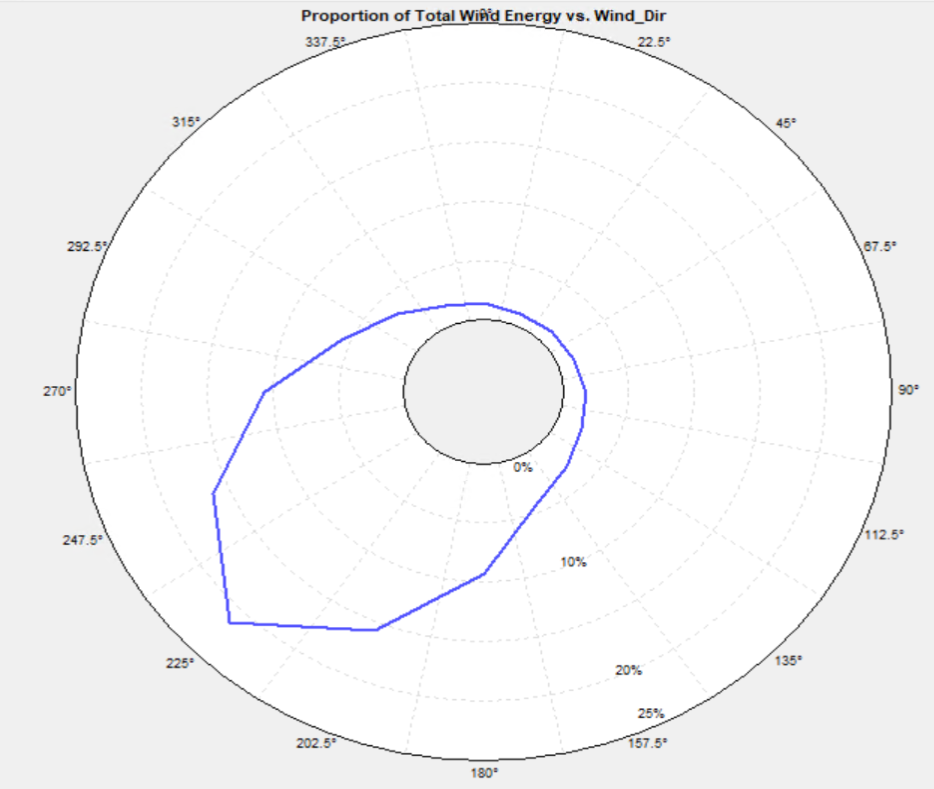

# Simulated Wind Data

Auto-regressive models effectively capture typical time series behavior where 
time steps that are close together are highly correlated. Here, an probabilistic auto-regressive model
simulates hourly ERA-5 wind speed and direction data which have a high degree of auto-correlation.

However, unlike simple auto-regressive models, this simulation mimics the long-term seasonal and daily 
trends of the training data set using a fourier fit.

Look below to see the local phenomena generated at a time-step by time-step level as well as the 
long-term features generated such as distribution, wind rose, and monthly/dirunal profiles.

Original             |  Generated
:-------------------------:|:-------------------------:
  |  
  |  
  |  
  |  

